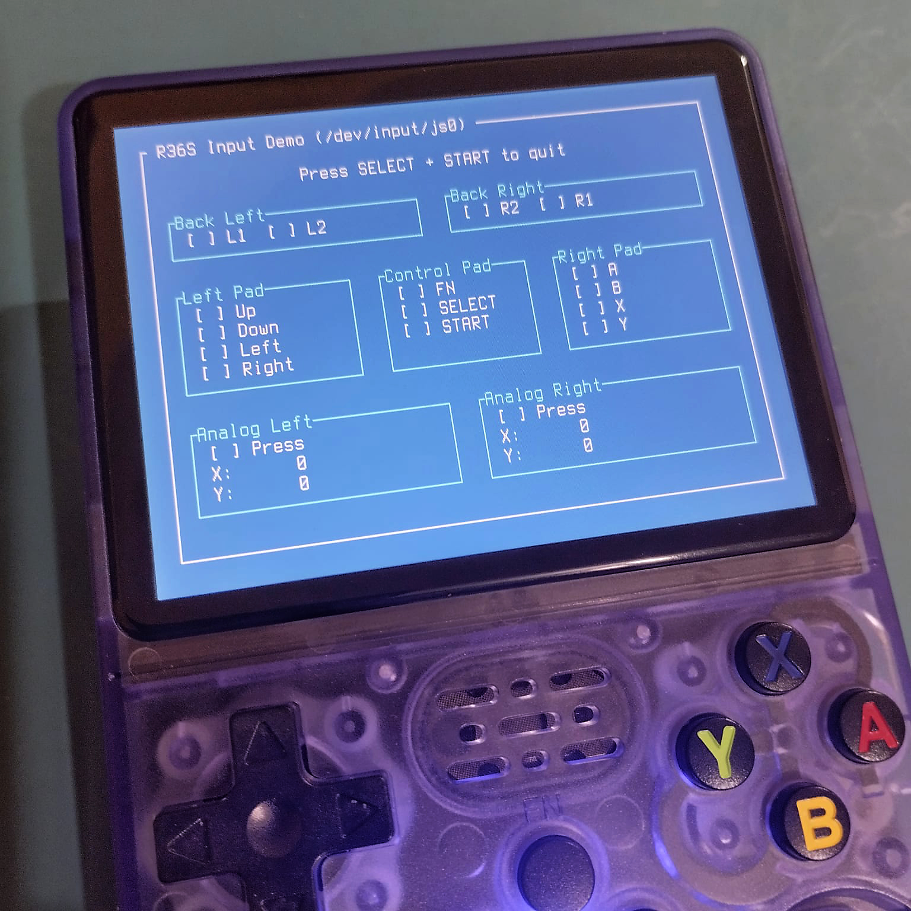

# Intro

A few months ago, I bought a portable R36S console. While I do enjoy some old-school emulated games, I mainly bought it with the intention of “hacking” it, and last weekend I decided to actually get my hands dirty: I wrote a simple program in Rust that reads the states of the buttons and joysticks and displays them on the screen. I did this because I wanted to practice a bit of cross-compiling in Rust — a technique in which I develop software on one platform but compile it to generate a binary that will run on another.

# The Console

The R36S is a portable console manufactured by some chinese companies (there are “clones” of it), designed for emulation of retro consoles.

It usually comes with the ArkOS operating system (based on the Ubuntu Linux distribution), specifically geared towards retro emulation. Its hardware architecture is designed for energy efficiency. It has an RK3326 chipset that integrates a 64-bit quad-core ARM Cortex-A35 processor.

# The Project

By researching and experimenting, I found out that the console inputs can be read from the ```/dev/input/js0``` device. It has 17 buttons, which are mapped from ```0``` to ```16```, while the analog joystick axes are mapped from ```0``` to ```3``` (there are also some buttons on the side of the console, but I decided not to use them, since they are usually used to power the console on/off, reset it, and control the volume).


The goal, then, was simple: write a program that continuously “watches” for changes in the state of the buttons and joysticks and displays those states on the screen. I decided to implement the program’s interface in text mode, since the console’s operating system is Linux and I concluded I could use a “terminal mode”. To build the screen layout, I decided to use [ratatui](https://ratatui.rs/), a Rust library specifically designed for creating TUIs (Text User Interfaces).

# Step by step

For anyone who wants to reproduce the experience, here is the project step by step.

### 1 – Requirements

This project was developed in a WSL environment (Ubuntu 24.04.1 on Windows) on a 64-bit PC. This tutorial assumes that you are using this development environment. If you are working in a different environment, you must take those differences into account. The first step is to make sure the operating system is up to date. Open the terminal and type:

```bash
sudo apt update

sudo apt upgrade -y
```

### 2 – Installing Rust

The commands below install the toolchain (compiler and toolset):

```bash
curl --proto '=https' --tlsv1.2 -sSf https://sh.rustup.rs | sh -s -- -y

. "$HOME/.cargo/env"
```

If you want to check whether Rust was installed correctly, just type:

```bash
cargo --version
```

Cargo is the package and build manager of the Rust ecosystem. This command will show the installed version of Cargo. In my case, 1.91.1.

### 3 – Installing the target

Let us remember that this is a cross-compiling project. In practice, we are developing on a 64-bit Linux PC (**Linux x86_64**), but we are going to compile the program to run in an environment with an ARM processor (**Linux aarch64**). To make this possible, we will use the rustup tool to install the desired target:

```bash
rustup target add aarch64-unknown-linux-musl
```

To check whether the target (the new target platform) was installed correctly, type:

```bash
rustup target list --installed
```

You should see the current target (the one you are using to develop) and the newly installed target. In my case:

```text
aarch64-unknown-linux-musl
x86_64-unknown-linux-gnu
```

### 4 – Installing development dependencies

Since we are compiling for the Linux aarch64 platform, the Rust compiler still needs external tools to complete the linking of the executable binary. It can perform the first compilation stage just fine, generating the object files, but the component that creates the final binary is the linker — typically cc, gcc, or clang. To install these dependencies, type:

```bash
sudo apt install build-essential -y
```

### 5 – Cloning the repository

Download and access the project’s source code with the commands:

```bash
git clone https://github.com/luizferreira-io/r36s-input-demo

cd r36s-input-demo
```

Note: **git** usually comes preinstalled on Ubuntu. If, in your case, **git** is not installed, install it so that you can clone the source code repository as shown above.

### 6 – Building

To build the project, type:

```bash
cargo build --release --target aarch64-unknown-linux-musl
```

With this command, Cargo (Rust’s package and build manager) will download the required libraries and build the project, using **aarch64-unknown-linux-musl** as the target platform.

The compiled binary program will be available in the ```target/aarch64-unknown-linux-musl/release/``` subdirectory.

### 7 – Copying the binary to the console and adding it to the menu

The deployment strategy adopted in this project was to install the program in the ```/roms/ports``` directory. On the R36S console, this directory is a special location intended for native games and applications that are not emulator ROMs. It acts as a kind of hub for games, engines, and programs that are real Linux executables — including binaries written by you.

The directory structure should look like this:

```text
/roms/ports/r36s-input-demo/r36s-input-demo
/roms/ports/R36S_Input_Demo.sh
```

The files ```rs36s-input-demo``` and ```R36S_Input_Demo.sh``` are executables. The ```R36S_Input_Demo.sh``` file should contain the script shown below:

```bash
#!/bin/bash

PORTNAME="R36S Input Demo"
GAMEDIR="/roms/ports/r36s_input_demo"

cd "$GAMEDIR"

if [ -z "$ESUDO" ]; then
  ESUDO="sudo"
fi

$ESUDO chmod 666 /dev/tty1 2>/dev/null
$ESUDO chmod 666 /dev/input/js0 2>/dev/null
$ESUDO chmod +x ./r36s_input_demo

$ESUDO ./r36s_input_demo < /dev/tty1 > /dev/tty1 2>&1
```

To copy the files to the console, you have two options:

**Option A (simpler):**

Connect the memory card to the PC and copy the files directly to the correct directory on the memory card.

**Option B (requires some basic Linux knowledge):**

Upload the files to the console. To do this, you will need to enable Wi-Fi, if you have a USB Wi-Fi device that fits it. You will also need to enable remote services, by going to the main menu Options -> ENABLE REMOTE SERVICES.

With the service enabled, open the browser and, in the address bar, type the IP address of the console on your Wi-Fi network. To see the IP, go to the main menu Options –> WIFI –> Current Network Info.

Use the menu to upload the files. Using this method, they are usually saved inside the console under the ```/roms2``` directory. You will have to access the console via SSH to move them to the correct location. To do this, type:

```bash
ssh ark@IP_OF_YOUR_CONSOLE
```

By default, the password for the ```ark``` user is ```ark```.

Once you have accessed the console, move the files to the indicated directories and mark them as executable (```chmod +x```).

### 8 – Conclusion

After doing this, your console should display the PORTS option in the initial menu, with the “game” ```R36S_INPUT_DEMO```.

